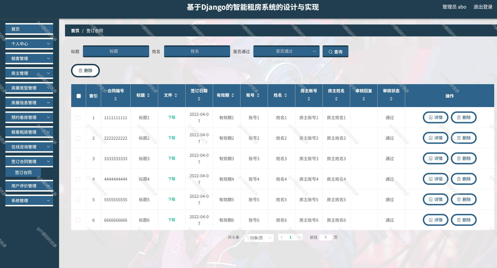

# python045
python045基于Python+Django的房屋租赁租房系统
 
## 查看主页获取源码

### 一、关键词
租房系统，智能租房系统

### 二、作品包含
源码+数据库+万字文档+全套环境和工具资源+部署教程

### 三、项目技术
前端技术：Vue2.0、Element-ui、Layui
后端技术：Python3.7、Django2.0

### 四、运行环境（以下版本亲测，其他版本未知，请自测）
开发工具：PyCharm + VSCODE

数据库：MySQL5.7（最低要5.7版本）

数据库管理工具：Navicat10+

Python：Python3.7

前端Nodejs：14

浏览器：谷歌浏览器

### 五、项目介绍
项目编号：python045

随着社会的快速发展，计算机的影响是全面且深入的。人们生活水平的不断提高，日常生活中人们对租房系统方面的要求也在不断提高，租房系统得到广大租客的青睐，使得租房系统的开发成为必需而且紧迫的事情

租房系统为管理员、房主、租客三类角色，分别提供涵盖首页、个人中心、房屋及租客管理、预约看房、在线咨询、合同及评价管理等全流程租房业务功能 。

### 六、运行截图

